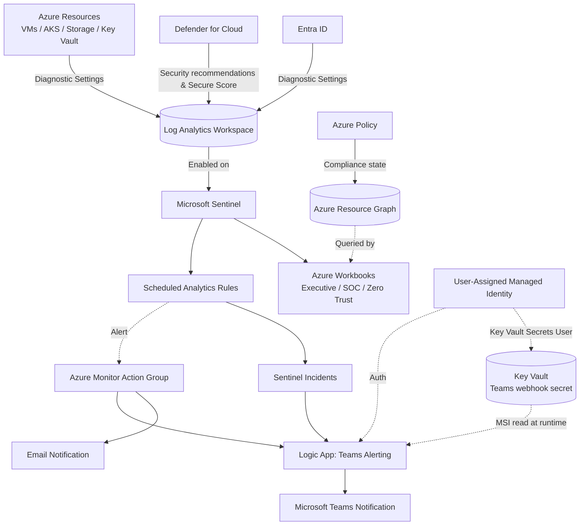
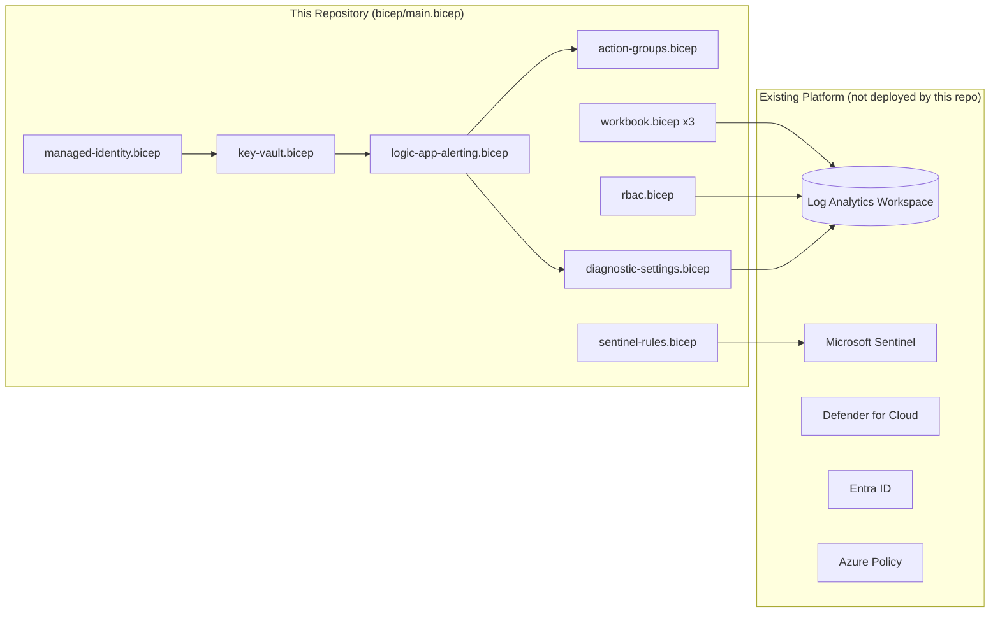

# Architecture Guide

## 1. Logical data flow



## 2. Deployment / control-plane view



## 3. RBAC / Zero Trust model

```mermaid
flowchart TD
    SOC[SOC Analysts Group] -->|Sentinel Responder\nLog Analytics Reader\nWorkbook Reader| LAW[(Log Analytics Workspace)]
    SecAdmin[Security Admins Group] -->|Sentinel Contributor\nSecurity Admin| LAW
    Exec[Executives Group] -->|Sentinel Reader\nWorkbook Reader| LAW
    Audit[Auditors Group] -->|Security Reader\nLog Analytics Reader| LAW
    MI[Logic App Managed Identity] -->|Key Vault Secrets User\n(least privilege, single secret)| KV[(Key Vault)]
```

All role assignments are scoped directly to the Log Analytics Workspace resource (not the subscription or resource group), so a compromised or over-provisioned identity cannot reach beyond security telemetry and Sentinel. See `modules/rbac.bicep`.

## 4. Component inventory

| Layer | Azure Service | Owned by this repo? |
|---|---|---|
| SIEM | Microsoft Sentinel | No (existing) |
| Log platform | Log Analytics Workspace | No (existing) |
| CSPM/CWP | Defender for Cloud | No (existing) |
| Identity | Entra ID | No (existing) |
| Governance | Azure Policy | No (existing) |
| Dashboards | Azure Workbooks x3 | **Yes** |
| Detections | Sentinel Scheduled Analytics Rules x5 | **Yes** |
| Alert routing | Azure Monitor Action Group | **Yes** |
| Notification delivery | Logic App (Consumption) | **Yes** |
| Secret storage | Key Vault (RBAC-authorized) | **Yes** |
| Identity for automation | User-assigned Managed Identity | **Yes** |
| Access control | Role assignments (4 personas) | **Yes** |

## 5. Why diagnostic settings for "Azure Resources" is not a generic Bicep module

The architecture diagram shows arbitrary Azure resources flowing diagnostic logs into the Log Analytics Workspace. In Bicep, the `scope` of an extension resource (like `Microsoft.Insights/diagnosticSettings`) must be a symbolic resource reference of a **concrete, compile-time-known type** — there is no supported way to write one Bicep module that accepts an arbitrary resource ID string and attaches diagnostics to "whatever type that turns out to be" (this was verified against the Bicep compiler: passing a resource ID string directly to `scope` fails with `BCP036`).

Because of this, `modules/diagnostic-settings.bicep` in this repo is intentionally scoped to the **platform's own resources** (Key Vault, Logic App), where the type is known. For diagnostic settings across the broader, heterogeneous resource estate (VMs, AKS, Storage, arbitrary PaaS services), the Cloud Adoption Framework-recommended mechanism — and the one that scales without per-resource-type Bicep modules — is an **Azure Policy `DeployIfNotExists` assignment** (e.g. the built-in "Deploy Diagnostic Settings to Log Analytics workspace" policy initiative), which this environment already has available since Azure Policy is enabled. This repo does not re-implement that policy; it is an operational configuration step documented in [deployment-guide.md](deployment-guide.md#diagnostic-settings-at-scale).

## 6. Naming convention (CAF)

`<resource-type-abbreviation>-<workload>-<environment>-<region>-<instance>`

| Resource | Abbreviation | Example |
|---|---|---|
| Key Vault | `kv` | `kvcontososecopsprod...` (alnum only, 24 char max) |
| Managed Identity | `id` | `id-contoso-secops-prod-eus-001-logicapp` |
| Logic App | `logic` | `logic-contoso-secops-prod-eus-001-alerting` |
| Action Group | `ag` | `ag-contoso-secops-prod-eus-001` |
| Workbook | `wb` | `wb-contoso-secops-prod-eus-001-executive` |

## 7. Well-Architected Framework alignment

| Pillar | How this repo addresses it |
|---|---|
| Security | RBAC least privilege, MSI-only auth, Key Vault for secrets, private-by-default networking in test/prod |
| Reliability | Consumption Logic App with built-in retry policies; What-If gate before every deploy |
| Cost optimization | No new Log Analytics ingestion beyond the platform's own low-volume diagnostic logs; workbook queries are free reads |
| Operational excellence | 3-stage CI/CD (Validate/SecurityScan/WhatIf) before any deploy; environment-gated promotion |
| Performance efficiency | Scheduled rules run hourly (not continuous), matched to realistic SOC triage cadence |
