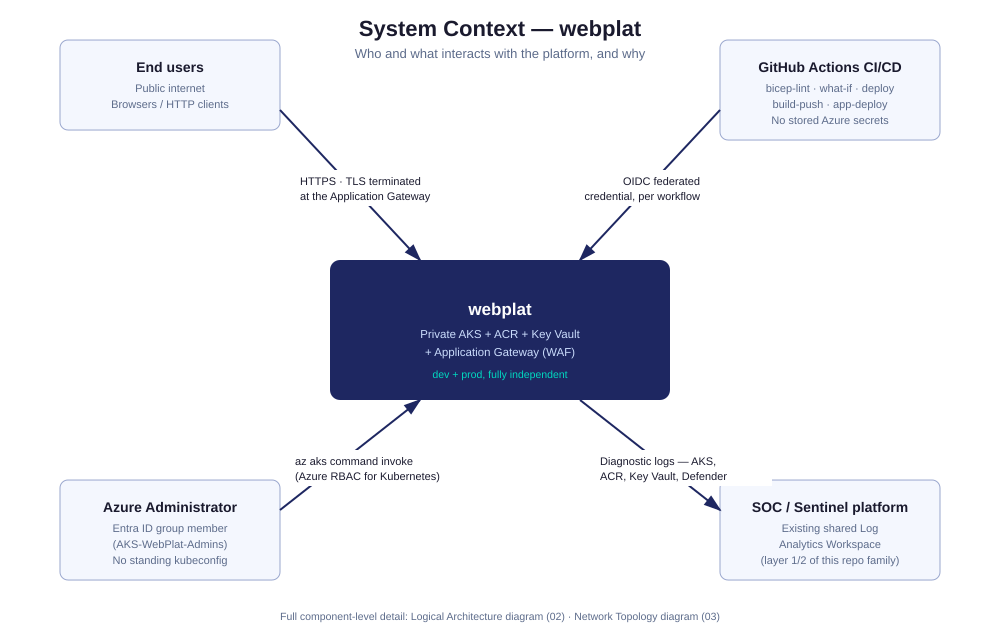
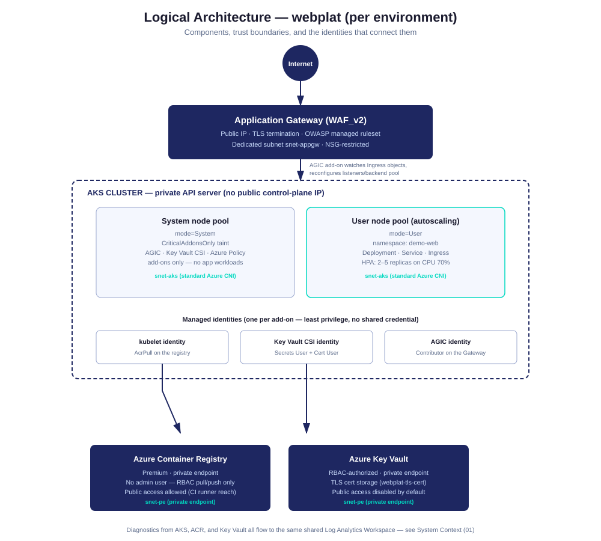
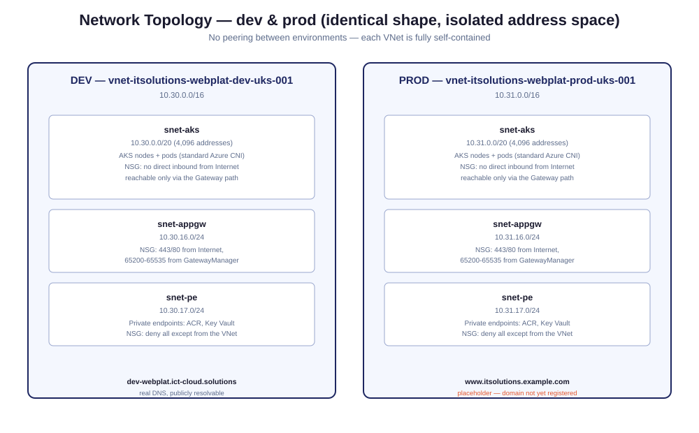
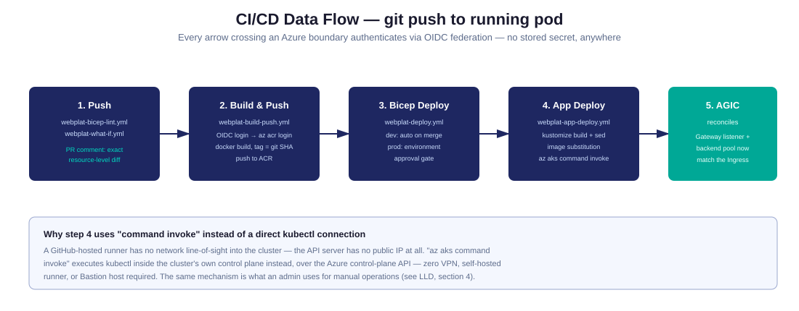

# High-Level Design (HLD) — webplat

| | |
|---|---|
| **Audience** | Solution/cloud architects, technical decision-makers, security reviewers |
| **Companion documents** | [LLD — Operations Runbook](lld-webplat-operations.md) (Azure admin/support team) · [Kubernetes Showcase](kubernetes-showcase.md) (portfolio narrative) · [webplat-architecture.md](webplat-architecture.md) (build history and incident log) |
| **Status** | Both environments deployed and verified end-to-end. See [Evidence](kubernetes-showcase.md#8-evidence-index) |
| **Last updated** | 2026-09-18 |

This document describes **what was built and why** — the architecture, the
decisions behind it, and the trade-offs accepted. It intentionally does not
cover step-by-step operational procedures; that's the LLD's job.

---

## 1. Business context and objectives

A company needs to host a public-facing web application on Azure with:

- A **production-grade security posture** by default — not bolted on later
- **Two isolated environments** (dev, prod) that behave identically but
  cannot affect each other
- **No standing human-held credentials** anywhere in the deployment path
- A **repeatable, auditable deployment process** — infrastructure and
  application changes both go through the same review gate
- Integration with an **existing security operations platform** (a shared
  Log Analytics Workspace already queried by Sentinel/SOC dashboards),
  rather than standing up a parallel monitoring stack

`webplat` is the resulting platform: a private Azure Kubernetes Service
(AKS) cluster, a private Azure Container Registry (ACR), a WAF-enabled
Application Gateway as the public front door, and GitHub Actions CI/CD
authenticating via OIDC federation.

## 2. Scope

**In scope:**
- AKS cluster, node pools, and cluster-level security configuration
- Container registry, image build/push pipeline
- Public ingress (Application Gateway + WAF + AGIC)
- TLS certificate delivery via Key Vault + CSI driver
- Network isolation (VNet, subnets, NSGs, private endpoints)
- CI/CD pipeline (Bicep deploy + application deploy)
- Diagnostic logging into the existing shared observability platform

**Out of scope** (see [webplat-architecture.md → Deferred](webplat-architecture.md#deferred-explicitly-out-of-scope-for-the-initial-delivery)
for the full list and rationale):
- Sentinel, the Log Analytics Workspace itself, Defender for Cloud, Entra
  Conditional Access, or Azure Policy assignment — these are a separate,
  lower-layer platform this repo builds on top of, not duplicates
- Azure Firewall/Front Door in front of the Application Gateway
- GitOps (Flux/Argo) — direct `kubectl apply` via CI is the current model
- A real CA-issued certificate (self-signed today, swappable without a
  redeploy)
- Multi-region/multi-AZ resilience

## 3. Architecture principles

These principles drove every design decision below, and are the standard
to hold any future change to:

1. **Private by default.** No component is publicly reachable unless the
   architecture requires it (only the Application Gateway's public IP is).
2. **No standing credentials.** Every cross-boundary connection — CI/CD to
   Azure, AKS to ACR, AKS to Key Vault, AGIC to the Gateway — authenticates
   via a managed identity or federated OIDC token, never a stored secret.
3. **Least privilege, per component.** Four separate managed identities
   exist (kubelet, Key Vault CSI, AGIC, plus the CI/CD deploy identity),
   each scoped to exactly what it needs and nothing else.
4. **Environments are peers, not siblings.** Dev and prod share a design,
   not infrastructure — no VNet peering, no shared cluster, no shared
   Key Vault. A prod incident cannot originate from dev.
5. **Reuse the platform that already exists.** Diagnostics land in the
   same Log Analytics Workspace the organization's existing Sentinel/SOC
   layer already queries — this is one more monitored workload, not a new
   monitoring silo.
6. **Everything is code.** Every resource is defined in Bicep; every
   Kubernetes object is defined in YAML under version control. There is
   no manually-clicked configuration this design depends on.

## 4. System context

Four actors interact with the platform, each through a distinct,
narrowly-scoped trust relationship:

| Actor | Interaction | Trust mechanism |
|---|---|---|
| End users | HTTPS requests to the public hostname | None required — public web traffic, filtered by WAF |
| Azure Administrator | Cluster operations (`get pods`, rollout status, etc.) | Entra ID group membership + Azure RBAC for Kubernetes — no kubeconfig ever issued |
| GitHub Actions CI/CD | Infra and application deploys | OIDC federated credential, scoped per workflow, short-lived |
| SOC / Sentinel platform | Receives diagnostic logs | One-directional — webplat pushes logs, has no read access back |

## 5. Logical architecture

**Request path**: Internet → Application Gateway (TLS termination, WAF
inspection) → AGIC-managed backend pool → `demo-web` Service → pod.

**Cluster shape**: two node pools per environment, split by purpose, not
just autoscaling policy:
- **System pool** (`mode: System`, tainted `CriticalAddonsOnly`) — runs
  only cluster add-ons (AGIC, Key Vault CSI driver, Azure Policy). No
  application workload can be scheduled here, even by accident.
- **User pool** (`mode: User`, autoscaling) — runs the application
  Deployment exclusively, scaled 2–5 replicas by an HPA on CPU
  utilization.

**Identity model**: no component shares a credential with another.
Kubelet pulls images using its own identity; the Key Vault CSI driver
mounts secrets using a second identity; AGIC reconfigures the Gateway
using a third. Each is a standing Azure managed identity, RBAC-scoped to
exactly one downstream resource (see the LLD's [RBAC matrix](lld-webplat-operations.md#3-identity--rbac-matrix)
for the exact role assignments).

**Data services**: ACR and Key Vault are both reachable via private
endpoint from inside the VNet. ACR additionally allows public access
(a deliberate, documented trade-off — see [§8.7](#87-acr-public-network-access)).
Key Vault does not — administrative operations against it require a
temporary, audited network-rule exception (see the LLD).

## 6. Network architecture

Each environment gets its own `/16` VNet, subdivided into three subnets
with distinct trust levels:

| Subnet | Purpose | Reachable from |
|---|---|---|
| `snet-aks` | AKS nodes and pods (standard Azure CNI — pod IPs are real, routable VNet addresses) | Only the Application Gateway subnet, and only on the app's port |
| `snet-appgw` | Application Gateway | Internet (443/80) and Azure's `GatewayManager` service tag (health probes) |
| `snet-pe` | Private endpoints for ACR and Key Vault | Only the VNet itself |

No two environments' VNets are peered or otherwise connected — an
intentional blast-radius boundary. A compromise or misconfiguration in
dev cannot reach prod's network at all, not even accidentally.

## 7. CI/CD and data flow

The deploy pipeline exists specifically to solve one hard constraint: the
AKS API server has no public IP, so a GitHub-hosted runner has no network
path to it at all. `az aks command invoke` — which executes `kubectl`
inside the cluster's own control plane over the Azure management API,
rather than a direct network connection — is what makes CI/CD possible
without a VPN, self-hosted runner, or Bastion host. This is the same
mechanism a human administrator uses (see the LLD).

Infra changes are gated by an automated `what-if` diff on every PR;
application changes are gated by the build succeeding and, for prod, an
environment approval.

## 8. Key design decisions

Presented as brief decision records — the alternative considered, and
why the chosen option won.

### 8.1 Azure CNI (standard) over Azure CNI Overlay

**Decision**: standard/flat Azure CNI, where pod IPs are real, routable
addresses from the VNet's subnet.
**Why**: AGIC (bring-your-own-gateway ingress) requires the Application
Gateway — which lives outside the cluster's network — to reach pod IPs
directly for its backend pool. Overlay-mode pod IPs are not routable
outside the cluster and are fundamentally incompatible with AGIC. This
was discovered the hard way (a live 502 Bad Gateway, root-caused to this
exact incompatibility) and required a full cluster recreation, since CNI
mode is immutable after cluster creation. The `/20` subnet size for
`snet-aks` is a direct consequence — standard CNI needs to size for nodes
*and* pods, not nodes alone.

### 8.2 AGIC (Application Gateway Ingress Controller) over an in-cluster ingress (e.g. nginx-ingress)

**Decision**: use AGIC to drive an actual Azure Application Gateway.
**Why**: gets WAF, TLS offload, and a managed Azure resource with its own
diagnostics/health-probe model "for free," instead of running and
patching an ingress controller as a cluster workload. The trade-off is
one extra hop and Azure-specific ingress annotations that don't transfer
to another Kubernetes distribution.

### 8.3 Private AKS API server

**Decision**: `enablePrivateCluster: true`, no public control-plane IP at all.
**Why**: the single highest-leverage attack-surface reduction available —
there is no API server endpoint to scan, brute-force, or exploit from the
internet. The cost is operational: no direct `kubectl` from a laptop,
ever — every operation goes through `az aks command invoke`, which is a
deliberate, accepted trade-off, not an oversight.

### 8.4 Two node pools, not one

**Decision**: separate system and user pools, with a taint physically
preventing application pods from landing on the system pool.
**Why**: cluster add-ons (AGIC, CSI drivers) staying available is a
different reliability concern from the application staying available.
Separating them means an application-side resource spike or crash loop
can't starve the add-ons that keep the cluster's core functions (ingress,
secret sync) working.

### 8.5 Bicep, not Terraform

**Decision**: Bicep, matching the rest of this repository family.
**Why**: this platform sits alongside an existing Bicep-based secops
platform in the same repo — one IaC toolchain, one CI/CD pattern, one set
of conventions for an operator to learn, rather than standing up a second
toolchain for no functional gain.

### 8.6 Kustomize overlays, not Helm

**Decision**: a `base/` + per-environment `overlays/{dev,prod}` Kustomize
layout.
**Why**: the per-environment differences here are small (replica counts,
hostnames, a few identity values) — Kustomize's patch model fits that
better than templating a full Helm chart for a single-app deployment.
The trade-off, learned the hard way, is discipline: every overlay must
carry the same patches (see [§7.2 of the LLD](lld-webplat-operations.md#72-the-overlay-parity-problem)
for the incident this caused when one overlay silently didn't).

### 8.7 ACR public network access

**Decision**: ACR allows public network access (identity-gated via RBAC,
not network-gated), while Key Vault does not.
**Why**: GitHub-hosted runners push images from outside the VNet with no
fixed IP range to allow-list — a fully private registry cannot be reached
by them at all. AKS's own pulls still prefer the private endpoint. Key
Vault has no equivalent operational need for public reachability from
CI, so it stays private by default; the trade-off there is a manual,
temporary network exception for admin certificate operations (documented
in the LLD) rather than a permanent opening.

## 9. Non-functional requirements

| Requirement | How it's met |
|---|---|
| **Security** | Private API server, RBAC-only cluster auth (no local accounts), OIDC-only CI/CD, default-deny NetworkPolicy, non-root/read-only-rootfs pods, WAF at the edge, no ACR admin user |
| **Availability** | Prod: `Standard` AKS control-plane tier (uptime SLA), 3-node system pool, HPA-managed 2–5 app replicas, autoscaling user pool |
| **Scalability** | HPA on CPU utilization; user node pool autoscales independently of the fixed system pool |
| **Auditability** | Every infra change is a reviewed PR with an automated What-If diff; every deploy is a GitHub Actions run with full logs; diagnostics flow to a governed, queried Log Analytics Workspace |
| **Cost** | Dev uses the `Free` AKS tier and smaller node counts/VM sizes; both environments tagged for cost-center attribution (`costCenter`, `environment`, `workload` tags) |
| **Compliance posture** | Prod resources additionally tagged `dataClassification: confidential`; Defender for Containers and the Azure Policy add-on are enabled on both clusters |

## 10. Risks and assumptions

| Risk / assumption | Status |
|---|---|
| Prod's hostname (`www.itsolutions.example.com`) is a placeholder — no real domain registered | Open; infrastructure and TLS flow are proven with a placeholder, real DNS is a config change, not a redesign |
| No dedicated prod Log Analytics Workspace exists yet — prod points at the dev-tier workspace | Open; noted in `bicep/params/webplat-prod.bicepparam` |
| No VPN/Bastion path into either VNet — admin operations against a private Key Vault require a temporary public-access exception | Accepted trade-off, documented and proceduralized in the LLD |
| Self-signed TLS certificate in both environments | Accepted for this stage; swapping for a CA-issued cert is a Key Vault operation, not a redeploy |
| A single Kustomize overlay silently missing a patch is a class of bug this design doesn't prevent structurally | Realized as a real incident (see [webplat-architecture.md](webplat-architecture.md#incident-prod-secretproviderclass-never-patched)); mitigated by documentation and the LLD's troubleshooting playbook, not yet by tooling |

## 11. Where to go next

- **Building or changing infrastructure?** [`webplat-architecture.md`](webplat-architecture.md) has the module-by-module Bicep reference and the full build history.
- **Operating the platform day-to-day, or something's broken?** [`lld-webplat-operations.md`](lld-webplat-operations.md) is written for exactly that.
- **Explaining this to a non-architect audience?** [`kubernetes-showcase.md`](kubernetes-showcase.md) and the accompanying slide deck.
